# Billing Recovery Execution Console

## One-Sentence Summary

A billing operations execution console that turns human-approved billing corrections into durable, idempotent provider execution requests with Stripe test-mode refunds, retry handling, reconciliation, manual recovery, auditability, and operational visibility.


## Product Thesis

Money-impacting operational workflows should not jump directly from human approval to external execution.

A reliable execution system needs a controlled lifecycle:

1. prepare context
2. evaluate deterministic policy
3. capture human approval
4. create a durable execution request
5. execute through a provider adapter
6. retry only when safe
7. reconcile against provider source of truth
8. route unresolved cases to manual recovery
9. preserve a complete audit trail

This project models that lifecycle through a working Streamlit + SQLite system with OpenAI-assisted case briefing and Stripe test-mode refund execution.

## Why This Project Exists

This project is part of my [GitHub product portfolio](https://github.com/sunny-aryan) focused on realistic working systems rather than coding demos.

Previous projects explored:

* AI-assisted decision support
* human-in-the-loop operational workflows
* product-grade operations UX
* external dependency awareness

This project focuses on the next progression:

> reliable execution after human approval.

The goal is to model what happens when an approved operational decision must become a safe, durable, auditable action against an external system.

## What This Project Demonstrates

This project is designed to demonstrate Senior / Principal Technical Product Management judgment across:

- execution reliability after human approval
- provider adapter design
- idempotency and duplicate prevention
- external API integration with Stripe test mode
- AI assistance with deterministic workflow boundaries
- retry eligibility and failure classification
- reconciliation against provider source of truth
- manual recovery for unresolved states
- auditability for money-impacting operations
- operational visibility through dashboard metrics
- realistic degraded-mode and forced-mock behavior


## Target Users

| User               | Responsibility                                                            |
| ------------------ | ------------------------------------------------------------------------- |
| Billing Ops Agent  | Reviews billing correction cases and prepares them for approval           |
| Finance Manager    | Approves or rejects money-impacting corrections                           |
| Execution Operator | Monitors failed executions, retries, and recovery paths                   |
| RevOps Lead        | Tracks operational health, execution reliability, and reconciliation gaps |


## Intended Workflow

Billing issue
→ human review
→ approval
→ execution request
→ external provider write
→ success / failure / timeout
→ retry / reconciliation
→ manual recovery if needed
→ audit trail

# Example Workflow Walkthrough

### Happy Path: Stripe Refund Execution and Reconciliation

1. Operator selects a billing case from the work queue.
2. Optional AI case brief summarizes the issue, customer impact, missing evidence, and risk notes.
3. Deterministic policy evaluation determines whether the correction can proceed.
4. Human reviewer approves the correction and records rationale.
5. Stripe test payment setup prepares a refundable test payment.
6. Execution request creates a durable internal command with an idempotency key.
7. Provider execution creates a Stripe test-mode refund or uses forced mock mode.
8. Execution attempt records provider response, refund ID, and error details if any.
9. Reconciliation verifies the provider refund state.
10. Audit trail records the end-to-end lifecycle.

### Failure / Recovery Path: Timeout or Unknown Provider State

1. Provider execution returns a timeout or unknown state.
2. The execution request moves to `needs_manual_review`.
3. Reconciliation checks provider source of truth.
4. If the provider state remains unknown or mismatched, the case is routed to manual recovery.
5. Operator records the recovery action, rationale, and optional provider reference.
6. Audit trail preserves the recovery decision.

## System Architecture

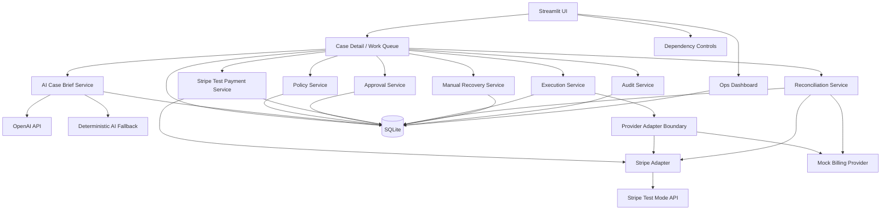
```mermaid
flowchart TD
    UI[Streamlit UI]

    UI --> CaseUI[Case Detail / Work Queue]
    UI --> OpsDashboard[Ops Dashboard]
    UI --> DependencyControls[Dependency Controls]

    CaseUI --> AIService[AI Case Brief Service]
    CaseUI --> PolicyService[Policy Service]
    CaseUI --> ApprovalService[Approval Service]
    CaseUI --> StripeSetup[Stripe Test Payment Service]
    CaseUI --> ExecutionService[Execution Service]
    CaseUI --> ReconciliationService[Reconciliation Service]
    CaseUI --> RecoveryService[Manual Recovery Service]
    CaseUI --> AuditService[Audit Service]

    AIService --> OpenAI[OpenAI API]
    AIService --> AIFallback[Deterministic AI Fallback]

    ExecutionService --> ProviderBoundary[Provider Adapter Boundary]
    StripeSetup --> StripeAdapter[Stripe Adapter]
    ProviderBoundary --> MockProvider[Mock Billing Provider]
    ProviderBoundary --> StripeAdapter
    StripeAdapter --> StripeAPI[Stripe Test Mode API]

    ReconciliationService --> MockProvider
    ReconciliationService --> StripeAdapter

    CaseUI --> SQLite[(SQLite)]
    AIService --> SQLite
    PolicyService --> SQLite
    ApprovalService --> SQLite
    StripeSetup --> SQLite
    ExecutionService --> SQLite
    ReconciliationService --> SQLite
    RecoveryService --> SQLite
    AuditService --> SQLite
    OpsDashboard --> SQLite
```

## Execution Lifecycle

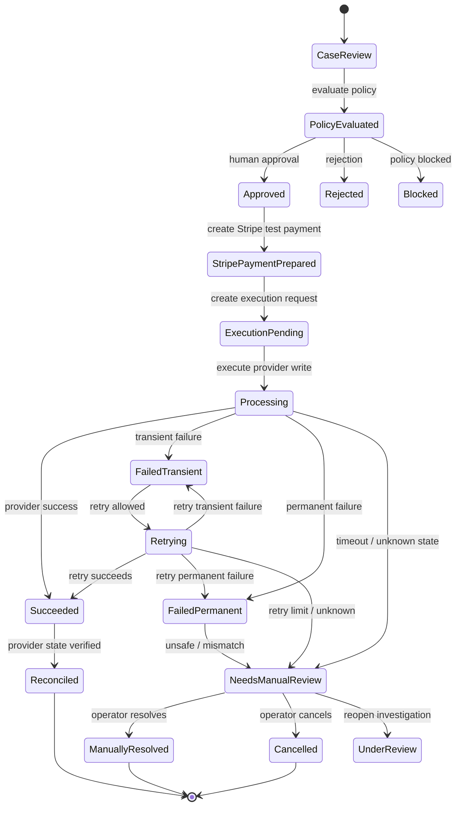
```mermaid
stateDiagram-v2
    [*] --> CaseReview
    CaseReview --> PolicyEvaluated: evaluate policy
    PolicyEvaluated --> Approved: human approval
    PolicyEvaluated --> Rejected: rejection
    PolicyEvaluated --> Blocked: policy blocked

    Approved --> StripePaymentPrepared: create Stripe test payment
    StripePaymentPrepared --> ExecutionPending: create execution request

    ExecutionPending --> Processing: execute provider write
    Processing --> Succeeded: provider success
    Processing --> FailedTransient: transient failure
    Processing --> FailedPermanent: permanent failure
    Processing --> NeedsManualReview: timeout / unknown state

    FailedTransient --> Retrying: retry allowed
    Retrying --> Succeeded: retry succeeds
    Retrying --> FailedTransient: retry transient failure
    Retrying --> FailedPermanent: retry permanent failure
    Retrying --> NeedsManualReview: retry limit / unknown

    Succeeded --> Reconciled: provider state verified
    FailedPermanent --> NeedsManualReview: unsafe / mismatch
    NeedsManualReview --> ManuallyResolved: operator resolves
    NeedsManualReview --> Cancelled: operator cancels
    NeedsManualReview --> UnderReview: reopen investigation

    Reconciled --> [*]
    ManuallyResolved --> [*]
    Cancelled --> [*]
```

## Provider Adapter Strategy


```mermaid
flowchart LR
    Approval[Human Approval] --> ExecReq[Durable Execution Request]
    ExecReq --> Idempotency[Idempotency Key]
    Idempotency --> ProviderChoice{Provider}

    ProviderChoice --> Mock[Mock Provider]
    ProviderChoice --> Stripe[Stripe Test Mode]

    Mock --> MockResult[Controlled success / failure / timeout]
    Stripe --> StripeRefund[Create Stripe Refund]

    StripeRefund --> RefundID[Store Refund ID re_...]
    MockResult --> ProviderObject[Store Provider Object ID]
    RefundID --> ProviderObject

    ProviderObject --> AttemptHistory[Execution Attempt History]
    AttemptHistory --> Reconciliation[Reconciliation]
    Reconciliation --> Verified[Reconciled]
    Reconciliation --> ManualReview[Needs Manual Review]
```

## External API Strategy

The project uses two external integrations for different product purposes:

| Integration | Purpose | Boundary |
|---|---|---|
| OpenAI | Summarize billing context and prepare reviewer brief | Advisory only; never approves or executes |
| Stripe test mode | Execute and reconcile a real test-mode refund | Provider write boundary after human approval and execution request creation |

Both integrations support forced mock mode so the app remains demo-friendly without external API calls.

Live API failures are handled through dependency-specific fallback behavior rather than a single global fallback flag.

## External Dependency Modes

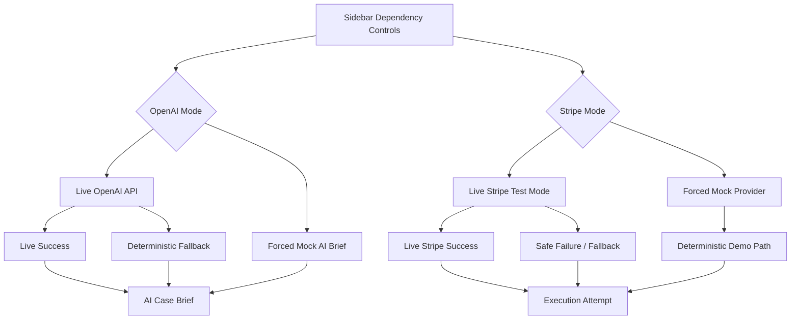
```mermaid
flowchart TD
    DependencyControls[Sidebar Dependency Controls]

    DependencyControls --> OpenAIMode{OpenAI Mode}
    DependencyControls --> StripeMode{Stripe Mode}

    OpenAIMode --> OpenAILive[Live OpenAI API]
    OpenAIMode --> OpenAIMock[Forced Mock AI Brief]
    OpenAILive --> OpenAISuccess[Live Success]
    OpenAILive --> OpenAIFallback[Deterministic Fallback]

    StripeMode --> StripeLive[Live Stripe Test Mode]
    StripeMode --> StripeMock[Forced Mock Provider]
    StripeLive --> StripeSuccess[Live Stripe Success]
    StripeLive --> StripeFallback[Safe Failure / Fallback]
    StripeMock --> MockExecution[Deterministic Demo Path]

    OpenAISuccess --> CaseBrief[AI Case Brief]
    OpenAIMock --> CaseBrief
    OpenAIFallback --> CaseBrief

    StripeSuccess --> ExecutionAttempt[Execution Attempt]
    StripeFallback --> ExecutionAttempt
    MockExecution --> ExecutionAttempt
```

The app includes dependency mode controls for upcoming OpenAI and Stripe integrations.

The app separates deliberate demo behavior from runtime failure handling.

Each dependency can be configured independently:

- **Live external API** — use real external API behavior when configured.
- **Forced mock / demo mode** — avoid external API calls and use deterministic mock behavior.

| Concept | Meaning |
|---|---|
| Forced mock | User-selected mode that avoids external API calls |
| Live external API | Uses configured OpenAI or Stripe credentials |
| Fallback | Runtime recovery path when a live dependency call fails |

OpenAI and Stripe are controlled independently. For example, OpenAI can run in forced mock mode while Stripe uses live test mode, or vice versa.


## AI Case Brief

The Case Detail page includes an AI Case Brief section before policy evaluation.

The brief can include:

- case summary
- customer impact
- missing evidence
- risk notes
- suggested reviewer questions
- customer message draft

The AI brief is advisory only. It does not approve, reject, execute, retry, reconcile, or override deterministic policy.

The OpenAI dependency can run in two modes:

- **Live external API** — calls OpenAI using `OPENAI_API_KEY`
- **Forced mock / demo mode** — returns a deterministic mock brief without making an external API call

If live OpenAI mode fails, the system uses a deterministic fallback brief and records that fallback was used.

## Stripe Provider Adapter

The project includes a Stripe provider adapter foundation.

At this stage, the adapter does not create payments or refunds yet. It only:

- validates whether a Stripe test-mode secret key is configured
- confirms that live Stripe behavior requires a key starting with `sk_test_`
- exposes provider readiness in the UI
- preserves the provider boundary used by future refund execution and reconciliation

Stripe is intentionally controlled separately from OpenAI. Stripe can be in live test mode while OpenAI is mocked, or vice versa.

Future commits will add:

- Stripe test payment setup
- Stripe test-mode refund execution
- Stripe refund reconciliation

## Stripe Test Payment Setup

The app can prepare a refundable Stripe test payment for a billing correction case.

Depending on the selected Stripe dependency mode:

- **Live external API** creates a real Stripe test-mode PaymentIntent using the configured `STRIPE_SECRET_KEY`.
- **Forced mock / demo mode** creates deterministic mock payment metadata without calling Stripe.
- **Fallback** creates deterministic fallback metadata if live Stripe setup fails.

This setup step does not issue a refund. It only prepares the external payment object that a later refund execution can reference.

Stripe test payment setup prepares the external test object. The execution request represents the system’s durable command after human approval. Provider execution is the actual Stripe refund write performed against that command. Separating these steps makes the workflow retryable, auditable, and easier to reconcile.

## Stripe Refund Execution

The app can execute a Stripe test-mode refund from an approved execution request.

The refund path supports:

- **Live Stripe test mode** — creates a real Stripe refund using the configured `STRIPE_SECRET_KEY`
- **Forced mock mode** — simulates a Stripe refund without making an external API call
- **Fallback behavior** — safely classifies Stripe execution failures without crashing the workflow

The execution request idempotency key is passed to Stripe when creating the refund, so retries are protected against duplicate external effects.

The Stripe refund ID is stored as the execution request provider object ID.

## Idempotency Strategy

The project uses different idempotency scopes for different operations.

| Operation | Idempotency Scope | Reason |
|---|---|---|
| Stripe test payment setup | Unique per local test payment setup run | A fresh demo run should create a fresh refundable test payment |
| Execution request creation | One execution request per approval | Prevents duplicate internal execution commands |
| Stripe refund execution | Stable per execution request | Retrying the same refund should not create duplicate refunds |

This distinction matters because overly broad idempotency keys can accidentally reuse stale provider objects, while overly narrow keys can allow duplicate money-impacting actions.

## Stripe Refund Reconciliation

The app can reconcile Stripe refund execution against Stripe source of truth.

For Stripe execution requests:

- **Live Stripe mode** retrieves the Stripe refund by refund ID.
- **Forced mock mode** uses deterministic Stripe refund lookup without calling Stripe.
- **Fallback behavior** routes unknown lookup failures safely toward manual review.

This verifies that internal execution state matches the provider’s refund state before the case is treated as fully reconciled.


## Screenshots

### Work Queue

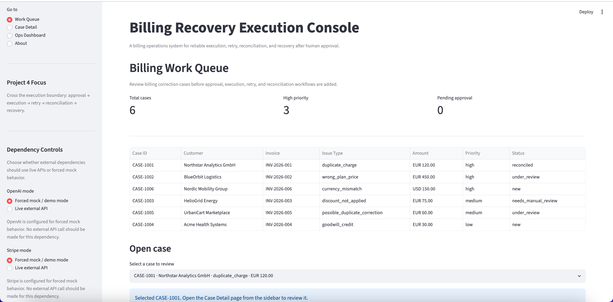

### Case Detail and Workflow Summary

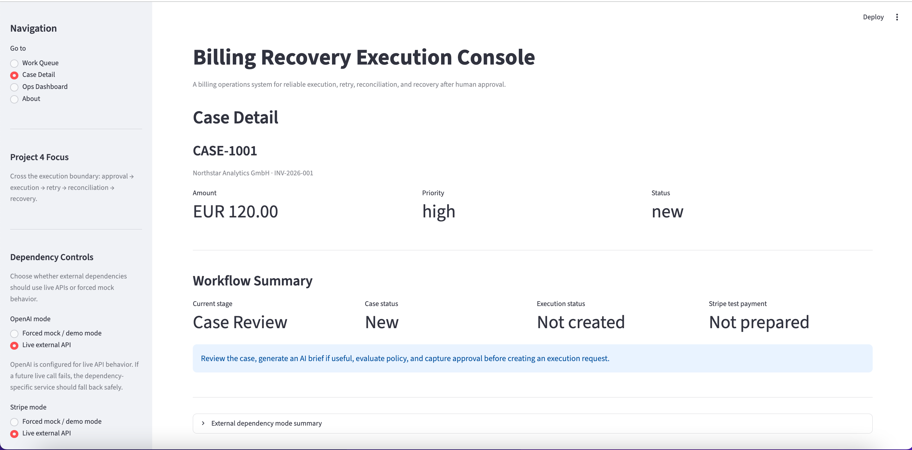

### AI Case Brief

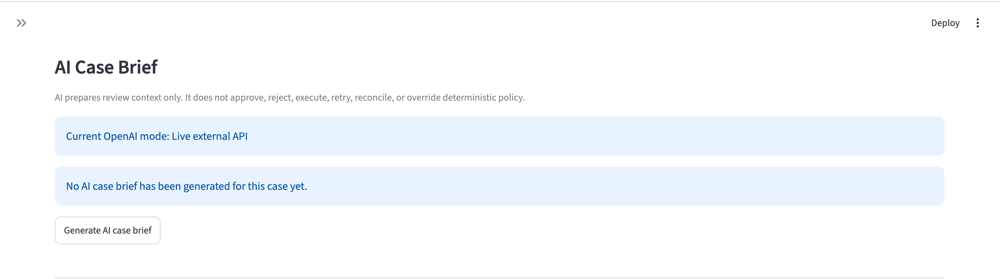
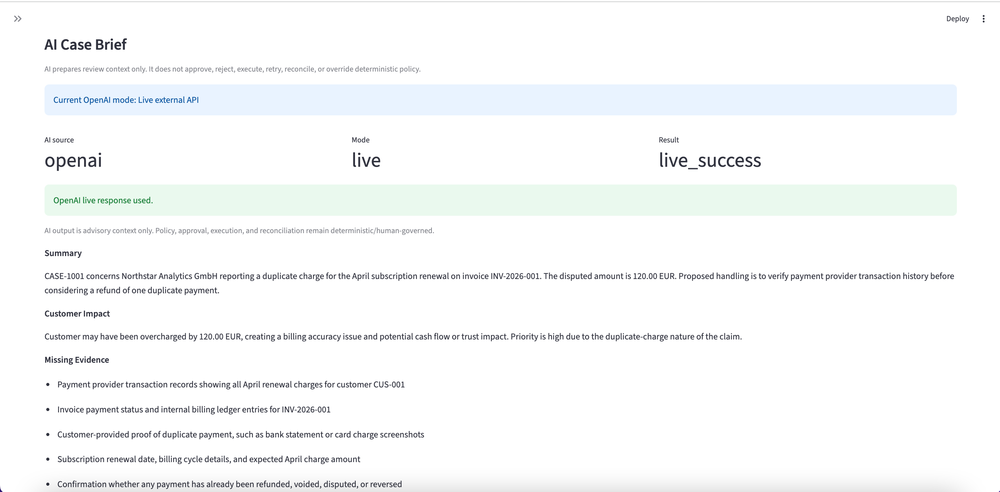
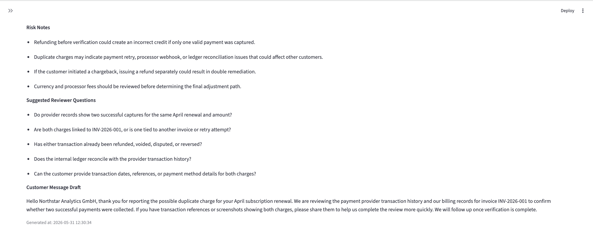

### Policy Evaluation and Human Approval

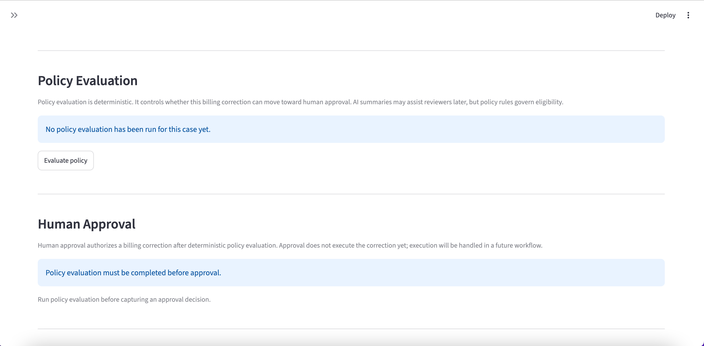
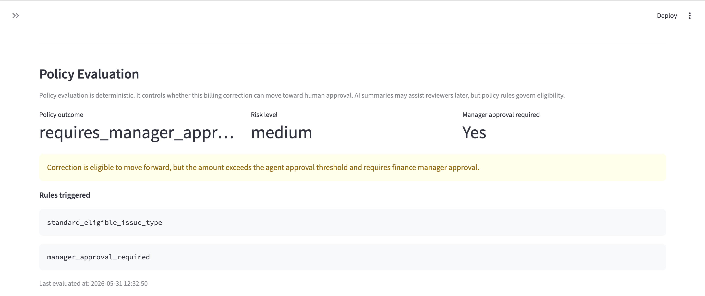
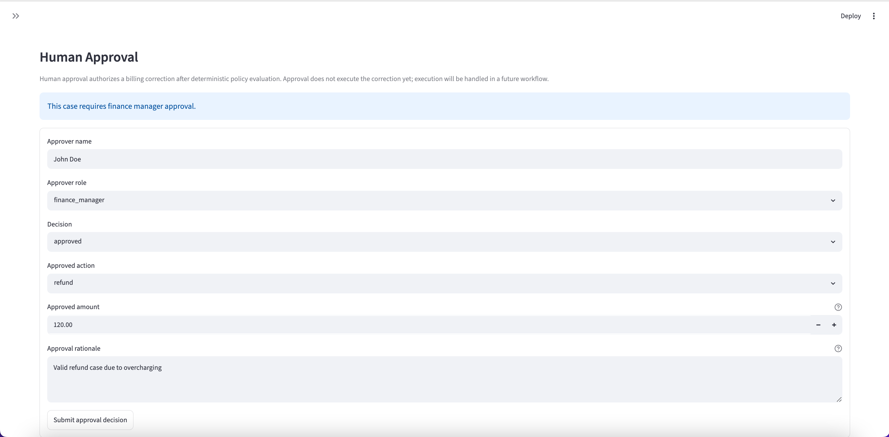

### Stripe Test Payment Setup

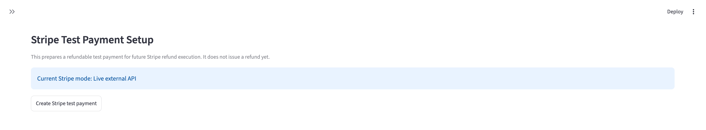
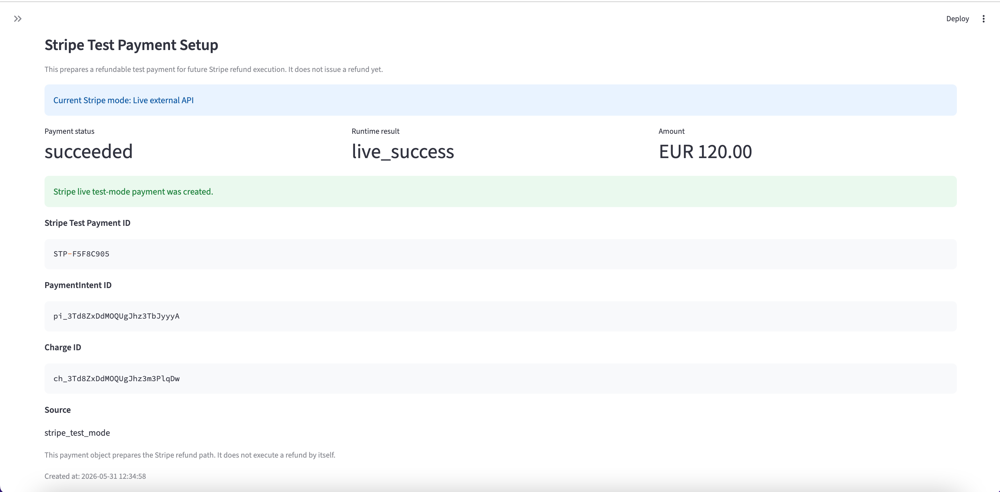

### Execution Request and Idempotency Key

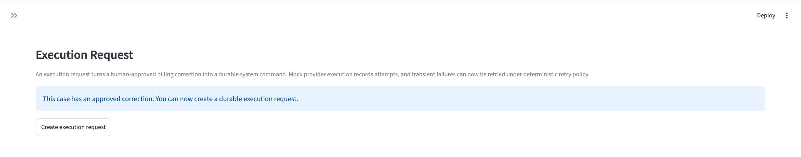
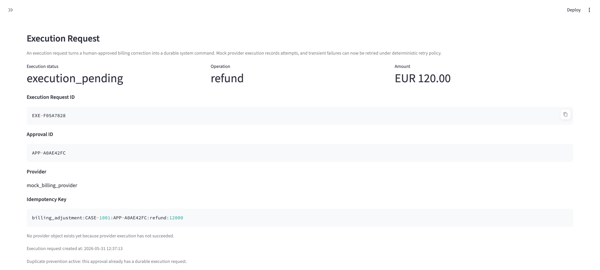

### Stripe Refund Execution Attempt

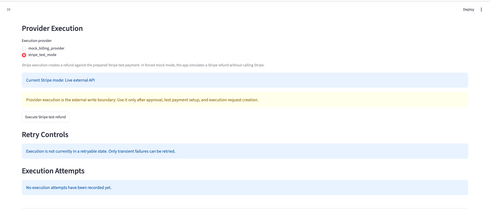
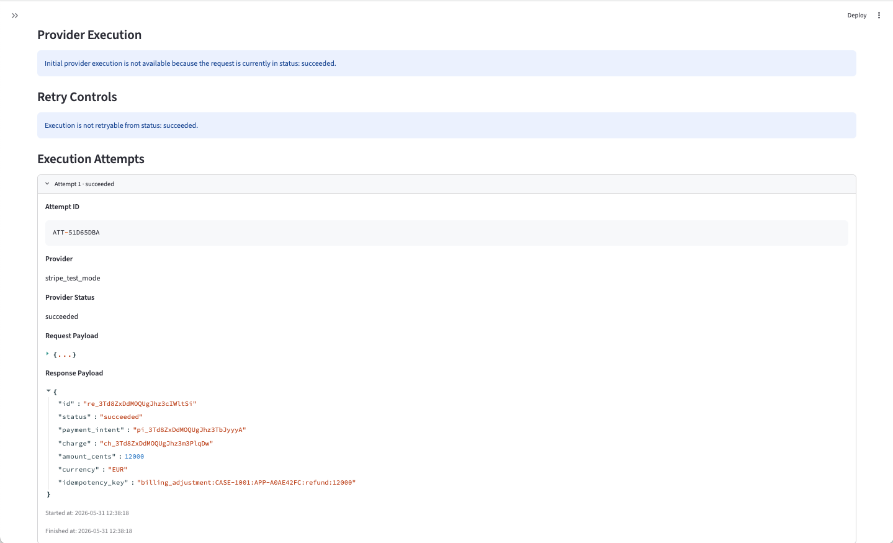

### Reconciliation

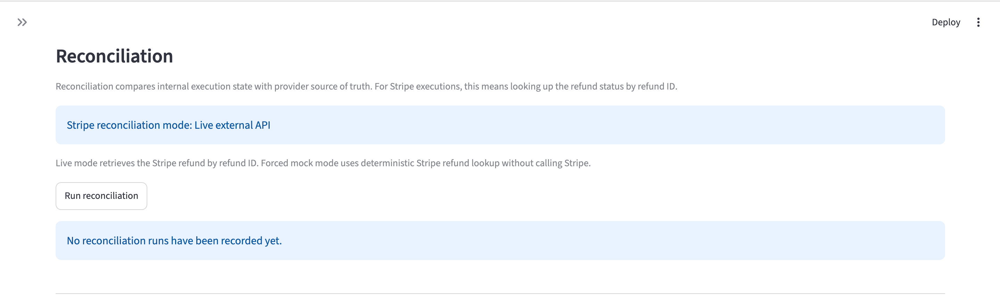
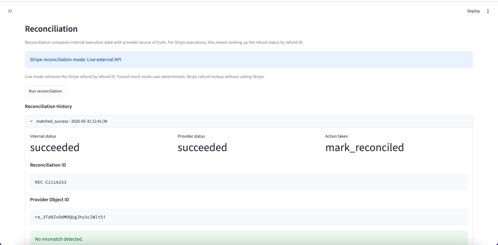

### Manual Recovery

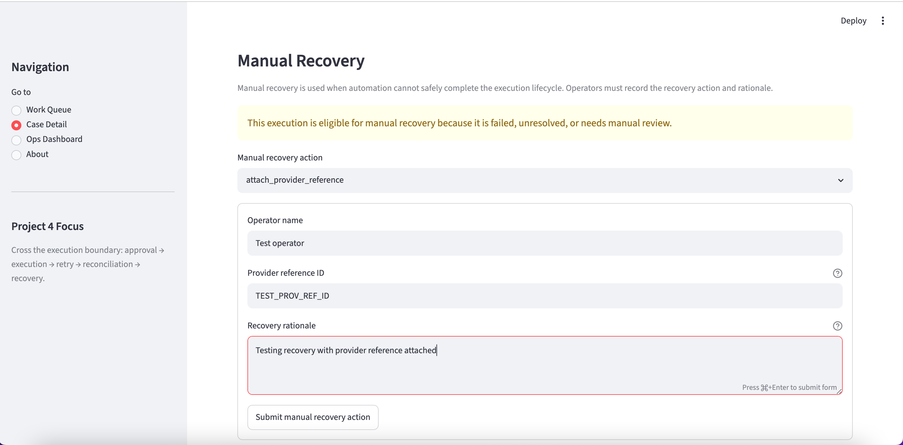

### Audit Trail

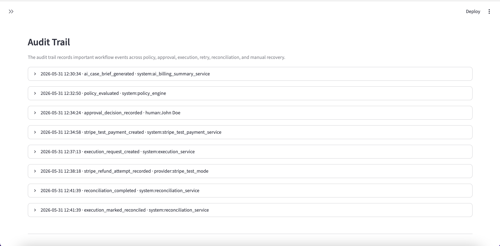
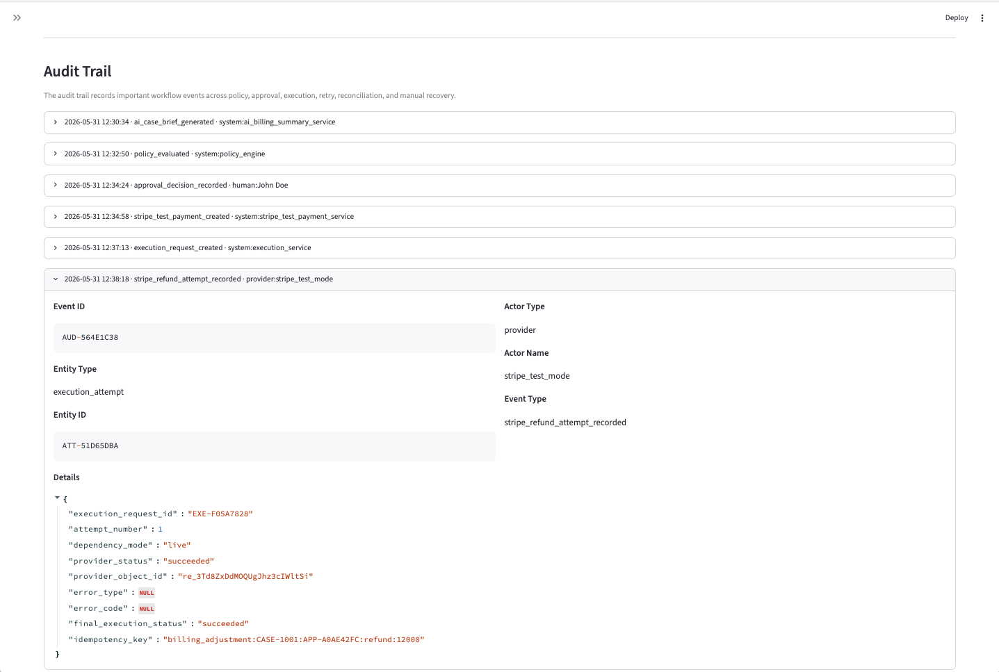

### Operations Dashboard

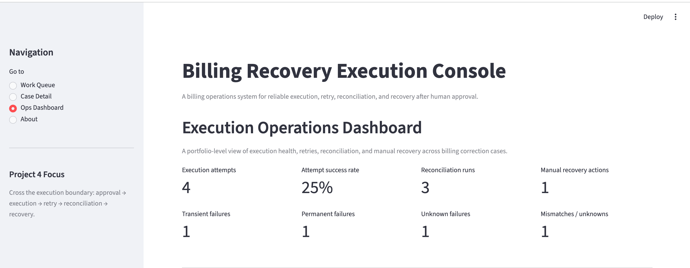
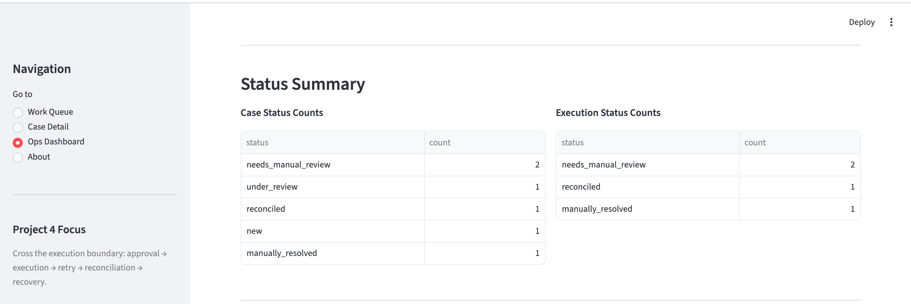
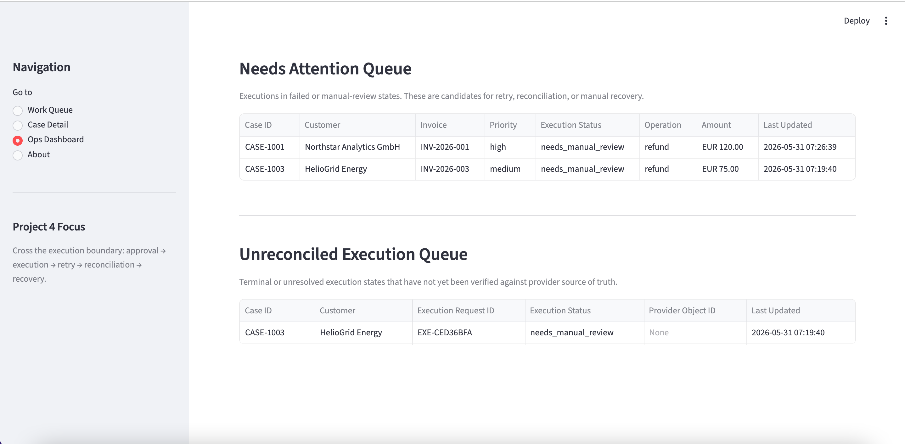

## Current Implementation

The current implementation supports:

- seeded billing correction cases
- billing work queue
- case detail view
- deterministic policy evaluation
- persisted policy outcomes
- human approval and rejection capture
- role-aware approval validation
- approval rationale capture
- durable execution request creation
- deterministic idempotency key generation
- duplicate execution request prevention
- mock provider execution
- execution attempt tracking
- provider success, transient failure, permanent failure, and timeout simulation
- execution status transitions after provider response
- retry eligibility evaluation
- manual retry for transient execution failures
- maximum retry limit
- retry attempt tracking
- automatic movement to manual review after retry limit is reached
- reconciliation against mock provider source of truth
- reconciliation history
- matched success detection
- matched failure detection
- mismatch detection
- routing unsafe mismatches to manual review
- manual recovery workflow for unresolved executions
- operator recovery action capture
- recovery rationale capture
- provider reference attachment
- manual recovery history
- state transitions to manually resolved, cancelled, or reopened
- centralized audit trail
- audit events for policy evaluation, approval, execution request creation, provider attempts, reconciliation, and manual recovery
- chronological case-level audit history
- structured JSON audit event details
- execution operations dashboard
- execution status summary
- retry and attempt metrics
- reconciliation summary metrics
- manual recovery summary metrics
- needs-attention queue
- unreconciled execution queue
- automated tests for core execution reliability workflows
- external dependency mode controls for OpenAI and Stripe
- demo-safe forced mock mode for upcoming external API integrations
- separate OpenAI and Stripe dependency modes
- AI billing case brief generation
- OpenAI live mode support
- forced mock AI brief mode
- deterministic fallback when OpenAI is unavailable or invalid
- AI brief audit events
- Stripe provider adapter foundation
- Stripe test-mode configuration checks
- provider adapter boundary for mock and Stripe providers
- Stripe readiness display without making external API calls
- Stripe test payment setup
- Stripe live test-mode PaymentIntent creation
- forced mock Stripe test payment metadata
- fallback test payment metadata when Stripe setup fails
- duplicate test payment prevention per case
- Stripe test-mode refund execution
- forced mock Stripe refund execution
- Stripe refund fallback handling
- Stripe refund ID persistence
- Stripe refund execution attempts
- Stripe refund audit events
- Stripe refund reconciliation
- Stripe refund status lookup
- forced mock Stripe reconciliation
- safe fallback when Stripe refund lookup fails
- reconciliation of Stripe refund ID against internal execution state
- workflow summary on the case detail page
- clearer dependency mode visibility
- Stripe/OpenAI live versus forced-mock status display
- next-action guidance based on execution state
- clearer UI boundaries for AI, test payment setup, provider execution, reconciliation, and manual recovery

Policy evaluation must happen before approval. Approval must happen before execution request creation. Execution requests will later be used by provider execution, retry, and reconciliation workflows.


## Architecture Direction

Streamlit UI
→ Case Service
→ Policy + Approval Services
→ Execution Service
→ Billing Provider Adapter
→ Reconciliation Service
→ SQLite Persistence + Audit Trail


## Reliability Control Model

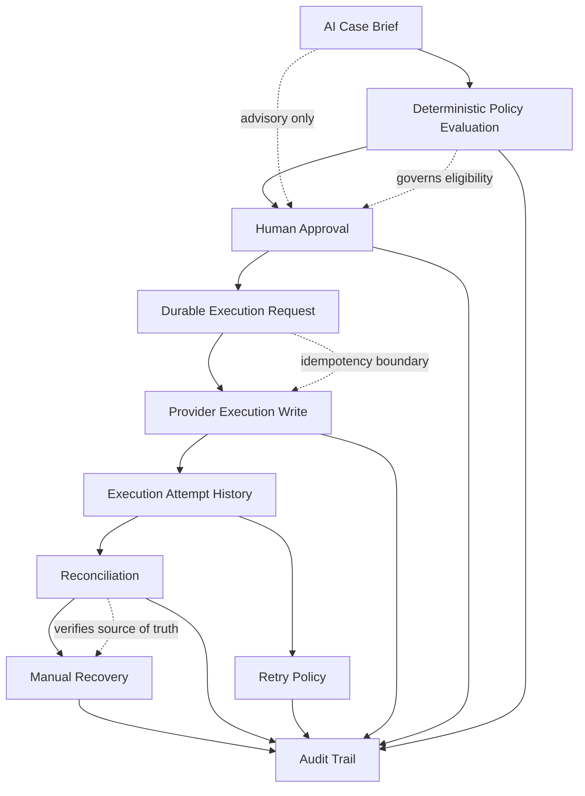
```mermaid
flowchart TD
    AI[AI Case Brief] --> Policy[Deterministic Policy Evaluation]
    Policy --> Human[Human Approval]
    Human --> ExecReq[Durable Execution Request]
    ExecReq --> ProviderWrite[Provider Execution Write]
    ProviderWrite --> Attempts[Execution Attempt History]
    Attempts --> Retry[Retry Policy]
    Attempts --> Reconcile[Reconciliation]
    Reconcile --> Recovery[Manual Recovery]
    Recovery --> Audit[Audit Trail]
    Reconcile --> Audit
    Retry --> Audit
    ProviderWrite --> Audit
    Human --> Audit
    Policy --> Audit

    AI -. advisory only .-> Human
    Policy -. governs eligibility .-> Human
    ExecReq -. idempotency boundary .-> ProviderWrite
    Reconcile -. verifies source of truth .-> Recovery
```

AI assists. Deterministic systems govern. Humans approve. Execution is auditable.


## AI and Deterministic System Boundary

This project will maintain a clear boundary between AI assistance and deterministic system control.

| Area                  | Role                                                                                                                |
| --------------------- | ------------------------------------------------------------------------------------------------------------------- |
| AI assistance         | Summarize billing issue, identify missing evidence, draft customer-facing context                                   |
| Deterministic systems | Policy evaluation, approval rules, execution state transitions, idempotency, retries, reconciliation, audit logging |

The product principle is:

> AI prepares context. Humans approve. Deterministic systems execute. Reconciliation proves completion.

## Operations Dashboard

The app includes an execution operations dashboard that summarizes system health across cases.

It helps operators answer:

- Which executions need attention?
- Which executions are unreconciled?
- How many provider attempts succeeded or failed?
- How often manual recovery is needed?
- Where execution reliability is breaking down?

This dashboard turns the project from a case-by-case workflow into a small operational control console.

## Workflow UX and Dependency Visibility

The Case Detail page includes a workflow summary that shows:

- current workflow stage
- case status
- execution status
- Stripe test payment readiness
- next recommended operator action
- execution identifiers such as execution request ID, provider, idempotency key, and provider object ID

The UI also makes external dependency behavior visible:

- OpenAI live mode versus forced mock mode
- Stripe live test mode versus forced mock mode
- provider readiness
- runtime fallback indicators when available

This keeps the app demo-friendly while still showing real external integration behavior.

## Current Seed Case Examples

The project currently includes synthetic billing cases such as:

* duplicate charge
* wrong plan price
* missing contract discount
* goodwill credit request
* possible duplicate correction
* currency mismatch

These cases are designed to support future policy, approval, execution, and reconciliation scenarios.

## How to Run Locally

### 1. Clone the repository

```bash
git clone https://github.com/sunny-aryan/billing-recovery-execution-console.git
cd billing-recovery-execution-console
```

### 2. Create and activate a virtual environment

```bash
python3 -m venv .venv
source .venv/bin/activate
```

### 3. Install dependencies

```bash
pip install -r requirements.txt
```

### 4. Create a local `.env` file

```bash
cp .env.example .env
```

Add your OpenAI API key and STRIPE_SECRET_KEY:

```text
OPENAI_API_KEY=your_api_key_here
STRIPE_SECRET_KEY=sk_test_your_test_key_here
```

The app can still run without an OpenAI and Stripe keys, but AI assistance will use deterministic fallback behavior.

### 5. Run the Streamlit app

You can use either one of the following two commands:

```bash
streamlit run app.py
```

```bash
python3 -m streamlit run app.py
```

Streamlit will print a local URL in the terminal, usually:

```bash
http://localhost:8501
```

### 6. Local database behavior

The app uses SQLite for local persistence.

The generated database file is ignored by Git and can be safely reset:

```bash
rm billing_recovery.db
```

On restart, the app recreates the local database and seeds cases from:

```text
data/seed_cases.json
```

## Automated Tests

The project includes automated tests for core execution reliability logic.

Test coverage includes:

- policy evaluation
- idempotency generation
- approval gating
- execution request duplicate prevention
- mock provider execution
- retry policy
- reconciliation outcomes
- manual recovery validation
- audit event creation
- OpenAI forced mock and fallback behavior
- Stripe adapter configuration
- Stripe test payment setup
- Stripe refund execution
- Stripe refund reconciliation

Run tests locally:

```bash
pytest
```

## Known Limitations

This is a portfolio prototype, not a production billing system.

Current limitations include:

- no authentication or role-based access control
- no background workers for scheduled retries or reconciliation
- no Stripe webhooks
- no production ledger or accounting system integration
- no real customer notification channel
- no production observability stack
- synthetic billing cases rather than real customer data
- Streamlit UI optimized for clarity over production-grade design

## Future Improvements

Potential next steps:

- add Stripe webhooks for asynchronous refund status updates
- add scheduled reconciliation jobs
- add role-based access control for reviewer, supervisor, and admin roles
- add ledger/accounting export after refund execution
- add customer notification drafts after execution or manual recovery
- add production observability with structured logs and traces
- add provider abstraction for additional billing providers
- add richer SLA and workload analytics in the operations dashboard